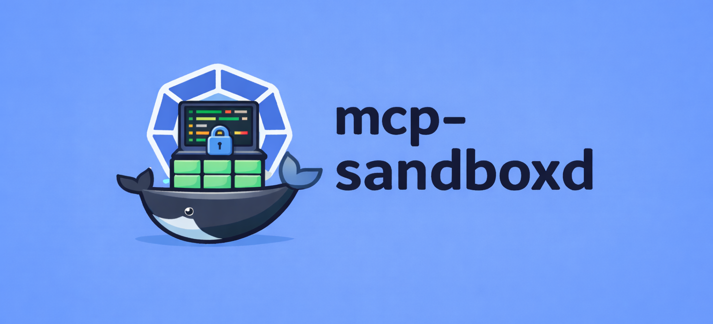

<p align="center">
  <i align="center">Persistent, container-backed sandboxes over MCP (HTTP + SSE)</i>
</p>

<h4 align="center">
  
  
  
  
</h4>

## What is `mcp-sandboxd`?

`mcp-sandboxd` is an MCP-compatible server that allows running arbitrary commands inside isolated sandboxes in Docker or Kubernetes.

The core idea is simple: an `identifier` (e.g. a chat id) maps to a long-running sandbox environment reused across runs. This makes agent workflows feel like a "real machine", without exposing your host.

## Use cases

- **Long-running sandboxes**: install deps once, iterate fast.
- **IDE integration**: run test/lint/build from your editor through MCP without polluting your machine.
- **Agent execution backend**: give an agent a place to run shell commands.
- **Artifact proxying**: generate files inside `/artifacts` and download them via the server HTTP endpoint.

## Tools

- [`run_sandbox`](docs/tools.md#run_sandbox): run one or more commands in a sandbox keyed by `identifier`.
- [`delete_sandbox`](docs/tools.md#delete_sandbox): delete a sandbox environment.
- [`restart_sandbox`](docs/tools.md#restart_sandbox): recreate a fresh sandbox for an identifier.

## Artifacts

Write files inside the sandbox under `/artifacts`. After a run completes, the server copies artifacts out of the sandbox into `ARTIFACTS_DIR` and serves them over HTTP.

From an MCP client’s point of view this is the same for local Docker, Docker-in-Docker, and the Kubernetes-native backend: clients always download via `GET /artifacts/...` and never talk to the sandbox filesystem directly.

- By run id: `GET /artifacts/<identifier>/<run_id>/<path>`
- Convenience alias: `GET /artifacts/<identifier>/latest/<path>`

## Quickstart (local Docker)

```sh
make docker-build-sandbox
cp .env.example .env
make dev
```

This starts the server on `http://localhost:8080`.

- MCP JSON-RPC endpoint: `http://localhost:8080/mcp`
- SSE stream (per run): `http://localhost:8080/mcp/events?run_id=...`

## MCP client configuration

Below are example configs for connecting to a running server over HTTP + SSE.

<details>
<summary>OpenCode</summary>

```json
// ~/.config/opencode/config.json
{
  "mcpServers": {
    "mcp-sandboxd": {
      "type": "sse",
      "url": "http://localhost:8080/mcp"
    }
  }
}
```

</details>

<details>
<summary>Claude / Claude Desktop (Remote MCP connector)</summary>

Add a custom connector and point it at your running server.

- URL: `http://localhost:8080/mcp` (or your deployed `https://.../mcp`)

</details>

<details>
<summary>Run via Docker (talking to host Docker socket)</summary>

Starts `mcp-sandboxd` on `http://localhost:8080/mcp`.


```json
{
  "mcpServers": {
    "mcp-sandboxd": {
      "type": "stdio",
      "command": "docker",
      "args": [
        "run",
        "--rm",
        "-i",
        "-p",
        "8080:8080",
        "-e",
        "PORT=8080",
        "-e",
        "MCP_PATH=/mcp",
        "-e",
        "SANDBOX_BACKEND=docker",
        "-e",
        "SANDBOX_IMAGE=ghcr.io/jeliasson/mcp-sandboxd-sandbox:latest",
        "-v",
        "/var/run/docker.sock:/var/run/docker.sock",
        "ghcr.io/jeliasson/mcp-sandboxd:latest"
      ]
    }
  }
}
```

</details>

## Docs

**General**
- [Architecture](docs/architecture.md): Protocol surface and internals.
- [Configuration](docs/configuration.md): Environment variables and defaults.
- [Images](docs/images.md): Published container images and tags.
- [Observability](docs/observability.md): Prometheus metrics.
- [Tools](docs/tools.md): Tool schemas and parameters.

**Backend**
- [Development](docs/development.md): Local workflow and make targets.
- [Docker](docs/docker.md): Docker socket setup and DinD pattern.
- [Kubernetes](docs/kubernetes.md): Kubernetes-native backend and DinD sidecar.

## Security notes

- `no-new-privileges` is enabled by default; `sudo` won’t work inside the sandbox.
- Use `run_sandbox.options.as_user="root"` for administrative operations.
- Prefer running `mcp-sandboxd` in a dedicated namespace with default-deny egress.

## Similar projects

- [pottekkat/sandbox-mcp](https://github.com/pottekkat/sandbox-mcp)
- [Automata-Labs-team/code-sandbox-mcp](https://github.com/Automata-Labs-team/code-sandbox-mcp)
- [alfonsograziano/node-code-sandbox-mcp](https://github.com/alfonsograziano/node-code-sandbox-mcp)

## License

[MIT](LICENSE)
