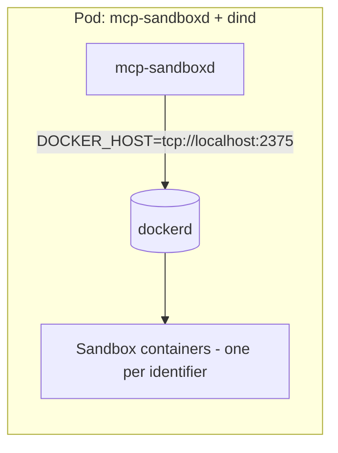

# Docker

The Docker backend manages one long-running sandbox container per `identifier`.

Artifacts behave the same as other backends: after a run completes, `mcp-sandboxd` copies `/artifacts` out of the sandbox and serves downloads via `GET /artifacts/...`.

## Local socket

See [Development](development.md) for local dev quickstart.

## DinD (Docker-in-Docker)

- Local: `make docker-run` starts a DinD container and points the server at it.
- Kubernetes: run `docker:dind` as a privileged sidecar.

## Kubernetes manifest

See [Kubernetes](kubernetes.md).

## Security notes

DinD typically requires `privileged: true`. Treat this as a high-trust component and isolate it (namespace + node pool + egress controls) if you execute untrusted code.
