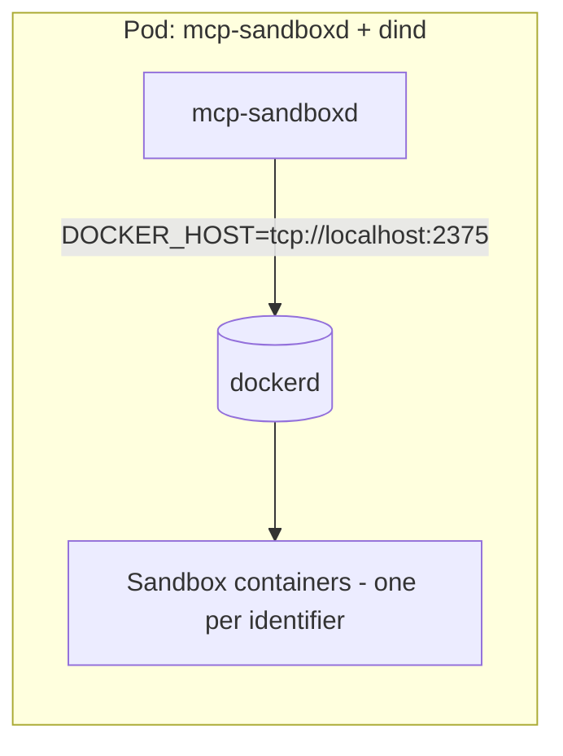

# Docker

The Docker backend manages one long-running sandbox container per `identifier`.

`mcp-sandboxd` supports two Docker deployment patterns:

- [Local socket](#local-socket): the server talks to your host Docker socket/daemon.
- [DinD (Docker-in-Docker)](#dind-docker-in-docker): the server talks to a Docker daemon provided by DinD.

Related docs:
- [Configuration](configuration.md)
- [Images](images.md)
- [Kubernetes](kubernetes.md)

## Local socket

- Set `SANDBOX_BACKEND=docker`.
- Set `SANDBOX_IMAGE` to the sandbox image you want to run.

See [Development](development.md) for local dev quickstart.

## DinD (Docker-in-Docker)

- Set `SANDBOX_BACKEND=docker`.
- Set `SANDBOX_IMAGE` to the sandbox image you want to run.

- Local: `make docker-run` starts a DinD container and points the server at it.
- Kubernetes: run `docker:dind` as a privileged sidecar.

DinD typically requires `privileged: true`. Treat this as a high-trust component and isolate it (namespace + node pool + egress controls) if you execute untrusted code.
