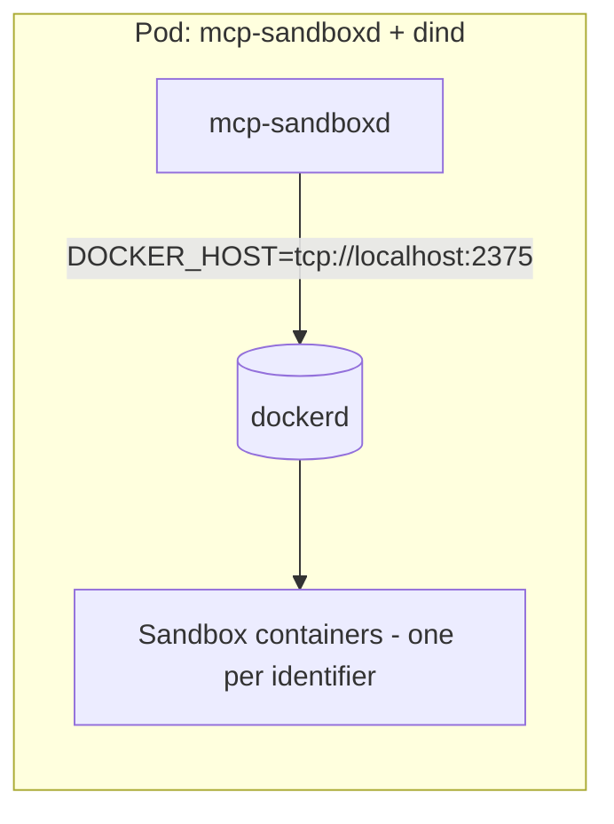

# Docker

The Docker backend manages one long-running sandbox container per `identifier`.

**Related docs**

- [Configuration](configuration.md)
- [Development](development.md)
- [Images](images.md)
- [Kubernetes](kubernetes.md)
- [Security](security.md)

`mcp-sandboxd` supports two Docker deployment patterns:

- [Local socket](#local-socket) (**recommended**): the server talks to your host Docker socket/daemon.
- [DinD](#dind): the server talks to a Docker daemon provided by DinD.

## Local socket

In this mode, `mcp-sandboxd` schedules sandbox containers via the Docker socket.

- Set `SANDBOX_BACKEND=docker`.
- Set `SANDBOX_IMAGE` to the sandbox image you want to run.

See [Development](development.md) for local dev quickstart.

## DinD

In this mode, `mcp-sandboxd` schedules sandbox containers via [Docker-in-Docker](https://hub.docker.com/_/docker#what-is-docker-in-docker) (DinD).

- Set `SANDBOX_BACKEND=docker`.
- Set `SANDBOX_IMAGE` to the sandbox image you want to run.
- Run `make docker-run` starts a DinD container and points the server at it.

## Security notes

- DinD generally requires `privileged: true`. Treat this as a high-trust component and isolate it if you execute untrusted code.
