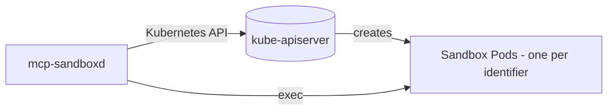

# Kubernetes

The Kubernetes backend manages one long-running sandbox Pod per `identifier`.

**Related docs**

- [Configuration](configuration.md)
- [Images](images.md)
- [Docker](docker.md)
- [Observability](observability.md)
- [Security](security.md)

`mcp-sandboxd` supports two Kubernetes deployment patterns:

- [Kubernetes Pod](#kubernetes-pod) (**recommended**): the server schedules sandbox Pods via the Kubernetes API.
- [DinD sidecar](#dind-sidecar): the server talks to a Docker daemon provided by a privileged `docker:dind` sidecar.

## Kubernetes Pod

In this mode, `mcp-sandboxd` schedules sandbox Pods via the Kubernetes API.

- Set `SANDBOX_BACKEND=kubernetes`.
- Set `SANDBOX_IMAGE` to the sandbox image you want to run.
- Uses `ServiceAccount` credentials to create Pods.



### RBAC

At minimum, the ServiceAccount needs permissions to manage Pods in the sandbox namespace.

### Example deployment

```yaml
---
# Sandboxes namespace
apiVersion: v1
kind: Namespace
metadata:
  name: mcp-sandboxd-sandboxes
---
# Sandboxd namespace
apiVersion: v1
kind: Namespace
metadata:
  name: mcp-sandboxd
---
apiVersion: v1
kind: ServiceAccount
metadata:
  name: mcp-sandboxd
  namespace: mcp-sandboxd
---
apiVersion: rbac.authorization.k8s.io/v1
kind: Role
metadata:
  name: mcp-sandboxd
  namespace: mcp-sandboxd-sandboxes
rules:
  - apiGroups: [""]
    resources: ["pods"]
    verbs: ["get", "list", "watch", "create", "delete"]
  - apiGroups: [""]
    resources: ["pods/exec"]
    verbs: ["create"]
---
apiVersion: rbac.authorization.k8s.io/v1
kind: RoleBinding
metadata:
  name: mcp-sandboxd
  namespace: mcp-sandboxd-sandboxes
subjects:
  - kind: ServiceAccount
    name: mcp-sandboxd
    namespace: mcp-sandboxd
roleRef:
  apiGroup: rbac.authorization.k8s.io
  kind: Role
  name: mcp-sandboxd
---
apiVersion: apps/v1
kind: Deployment
metadata:
  name: mcp-sandboxd
  namespace: mcp-sandboxd
spec:
  replicas: 1
  selector:
    matchLabels:
      app.kubernetes.io/name: sandboxd
  template:
    metadata:
      labels:
        app.kubernetes.io/name: sandboxd
    spec:
      serviceAccountName: mcp-sandboxd
      containers:
        - name: server
          image: ghcr.io/jeliasson/mcp-sandboxd:latest
          env:
            - name: PORT
              value: "8080"
            - name: MCP_PATH
              value: "/mcp"
            - name: SANDBOX_BACKEND
              value: "kubernetes"
            - name: KUBERNETES_SANDBOX_NAMESPACE
              value: "mcp-sandboxd-sandboxes"
            - name: SANDBOX_IMAGE
              value: ghcr.io/jeliasson/mcp-sandboxd-sandbox:latest
            - name: AUTO_BUILD_SANDBOX_IMAGE
              value: "false"
          ports:
            - containerPort: 8080
              name: http
          securityContext:
            allowPrivilegeEscalation: false
            seccompProfile: { type: RuntimeDefault }
            capabilities:
              drop: ["ALL"]
          resources:
            requests:
              cpu: "5m"
              memory: "32Mi"
            limits:
              cpu: "50m"
              memory: "64Mi"
          readinessProbe:
            httpGet:
              path: /mcp
              port: http
            initialDelaySeconds: 10
            periodSeconds: 10
            timeoutSeconds: 3
            failureThreshold: 6
          livenessProbe:
            httpGet:
              path: /mcp
              port: http
            initialDelaySeconds: 30
            periodSeconds: 20
            timeoutSeconds: 3
            failureThreshold: 6
---
apiVersion: v1
kind: Service
metadata:
  name: mcp-sandboxd
  namespace: mcp-sandboxd
spec:
  selector:
    app.kubernetes.io/name: sandboxd
  ports:
    - name: http
      port: 8080
      targetPort: http
```

### Hardening checklist

- Use a dedicated namespace for sandboxes.
- Apply a default-deny egress `NetworkPolicy` for the sandbox namespace.
- Use [`ResourceQuota`](https://kubernetes.io/docs/concepts/policy/resource-quotas/) and [`LimitRange`](https://kubernetes.io/docs/concepts/policy/limit-range/) to cap CPU, memory and ephemeral storage.
- Tune Linux capabilities via [`SANDBOX_CAP_DROP`](configuration.md#SANDBOX_CAP_DROP) / [`SANDBOX_CAP_ADD`](configuration.md#SANDBOX_CAP_ADD).

## DinD sidecar

In this mode, `mcp-sandboxd` schedules sandbox containers via [Docker-in-Docker](https://hub.docker.com/_/docker#what-is-docker-in-docker) (DinD).

### Security notes

- DinD generally requires `securityContext.privileged: true`. Treat this as a high-trust component and isolate it (namespace + node pool + egress controls) if you execute untrusted code.

### Example

See [Kubernetes Pod](#kubernetes-pod)'s example for a more complete example. Below just illustrates DinD specific.

```yaml
---
apiVersion: apps/v1
kind: Deployment
metadata:
  name: mcp-sandboxd
  namespace: mcp-sandboxd
spec:
  replicas: 1
  selector:
    matchLabels:
      app.kubernetes.io/name: sandboxd
  template:
    metadata:
      labels:
        app.kubernetes.io/name: sandboxd
    spec:
      containers:
        - name: server
          image: ghcr.io/jeliasson/mcp-sandboxd:latest
          env:
            # [...]
            - name: DOCKER_HOST
              value: tcp://localhost:2375
            - name: DOCKER_TLS_VERIFY
              value: "0"

          ports:
            - containerPort: 8080
              name: http

          # [...]

        - name: dind
          image: docker:29-dind
          args:
            - --host=tcp://0.0.0.0:2375
            - --host=unix:///var/run/docker.sock
            - --tls=false
          securityContext:
            privileged: true
          volumeMounts:
            - name: dind-storage
              mountPath: /var/lib/docker
      volumes:
        - name: dind-storage
          emptyDir: {}
```
