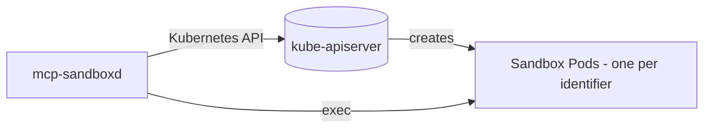

# Kubernetes

The Kubernetes backend manages one long-running sandbox Pod per `identifier`.

`mcp-sandboxd` supports two Kubernetes deployment patterns:

- [Kubernetes Pod](#kubernetes-pod): the server schedules sandbox Pods via the Kubernetes API.
- [DinD sidecar](#dind-sidecar): the server talks to a Docker daemon provided by a privileged `docker:dind` sidecar.

Related docs:
- [Configuration](configuration.md)
- [Images](images.md)
- [Docker](docker.md)

## Kubernetes Pod

In this mode, `mcp-sandboxd` schedules sandbox Pods via the Kubernetes API.

- Set `SANDBOX_BACKEND=kubernetes`.
- Set `SANDBOX_IMAGE` to the sandbox image you want to run.
- The server uses its ServiceAccount credentials to create Pods.
- Each `identifier` maps to one long-running sandbox Pod (persistent for the chat/session).

Artifacts behave the same as other backends: write files under `/artifacts` in the sandbox, then download them from the server via `GET /artifacts/...`.



### RBAC

At minimum, the ServiceAccount needs permissions to manage Pods in the sandbox namespace.

### Example (ServiceAccount + Role + Deployment)

```yaml
apiVersion: v1
kind: Namespace
metadata:
  name: mcp-sandboxd-sandboxes
---
apiVersion: v1
kind: ServiceAccount
metadata:
  name: mcp-sandboxd
  namespace: mcp-sandboxd
---
apiVersion: rbac.authorization.k8s.io/v1
kind: Role
metadata:
  name: mcp-sandboxd
  namespace: mcp-sandboxd-sandboxes
rules:
  - apiGroups: [""]
    resources: ["pods"]
    verbs: ["get", "list", "watch", "create", "delete"]
  - apiGroups: [""]
    resources: ["pods/exec"]
    verbs: ["create"]
---
apiVersion: rbac.authorization.k8s.io/v1
kind: RoleBinding
metadata:
  name: mcp-sandboxd
  namespace: mcp-sandboxd-sandboxes
subjects:
  - kind: ServiceAccount
    name: mcp-sandboxd
    namespace: mcp-sandboxd
roleRef:
  apiGroup: rbac.authorization.k8s.io
  kind: Role
  name: mcp-sandboxd
---
apiVersion: apps/v1
kind: Deployment
metadata:
  name: mcp-sandboxd
  namespace: mcp-sandboxd
spec:
  replicas: 1
  selector:
    matchLabels:
      app: mcp-sandboxd
  template:
    metadata:
      labels:
        app: mcp-sandboxd
    spec:
      serviceAccountName: mcp-sandboxd
      containers:
        - name: server
          image: ghcr.io/jeliasson/mcp-sandboxd:latest
          ports:
            - containerPort: 8080
              name: http
          env:
            - name: PORT
              value: "8080"
            - name: MCP_PATH
              value: "/mcp"
            - name: SANDBOX_BACKEND
              value: "kubernetes"
            - name: KUBERNETES_SANDBOX_NAMESPACE
              value: "mcp-sandboxd-sandboxes"
            - name: SANDBOX_IMAGE
              value: ghcr.io/jeliasson/mcp-sandboxd-sandbox:latest
            - name: AUTO_BUILD_SANDBOX_IMAGE
              value: "false"
---
apiVersion: v1
kind: Service
metadata:
  name: mcp-sandboxd
  namespace: mcp-sandboxd
spec:
  selector:
    app: mcp-sandboxd
  ports:
    - name: http
      port: 8080
      targetPort: http
```

### Hardening checklist

- Use a dedicated namespace for sandboxes.
- Apply a default-deny egress NetworkPolicy for the sandbox namespace.
- Use ResourceQuota/LimitRange to cap CPU/memory/ephemeral storage.
- Tune Linux capabilities via `SANDBOX_CAP_DROP` / `SANDBOX_CAP_ADD`.

## DinD sidecar

Most clusters run `containerd` on nodes, so there is no Docker daemon available by default. This pattern provides a **Docker daemon** via DinD.

Security notes:
- DinD generally requires `securityContext.privileged: true`.
- Treat DinD as a high-trust component and isolate it.

```yaml
apiVersion: apps/v1
kind: Deployment
metadata:
  name: mcp-sandboxd
  namespace: mcp-sandboxd
spec:
  replicas: 1
  selector:
    matchLabels:
      app: mcp-sandboxd
  template:
    metadata:
      labels:
        app: mcp-sandboxd
    spec:
      containers:
        - name: server
          image: ghcr.io/jeliasson/mcp-sandboxd:latest
          ports:
            - containerPort: 8080
              name: http
          env:
            - name: PORT
              value: "8080"
            - name: MCP_PATH
              value: "/mcp"
            - name: SANDBOX_BACKEND
              value: "docker"
            - name: SANDBOX_IMAGE
              value: ghcr.io/jeliasson/mcp-sandboxd-sandbox:latest
            - name: DOCKER_HOST
              value: tcp://localhost:2375
            - name: DOCKER_TLS_VERIFY
              value: "0"
            - name: AUTO_BUILD_SANDBOX_IMAGE
              value: "false"
          securityContext:
            runAsNonRoot: true
            runAsUser: 10001
            allowPrivilegeEscalation: false
            readOnlyRootFilesystem: true

        - name: dind
          image: docker:27-dind
          args:
            - --host=tcp://0.0.0.0:2375
            - --host=unix:///var/run/docker.sock
            - --tls=false
          securityContext:
            privileged: true
          volumeMounts:
            - name: dind-storage
              mountPath: /var/lib/docker

      volumes:
        - name: dind-storage
          emptyDir: {}
---
apiVersion: v1
kind: Service
metadata:
  name: mcp-sandboxd
  namespace: mcp-sandboxd
spec:
  selector:
    app: mcp-sandboxd
  ports:
    - name: http
      port: 8080
      targetPort: http
```
